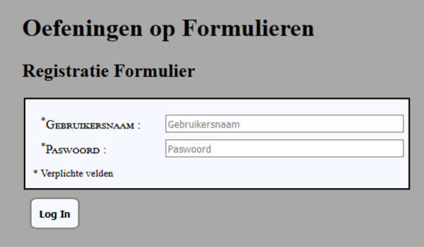
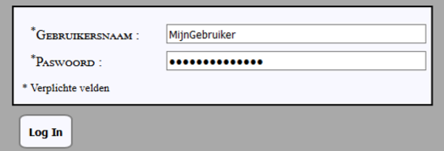
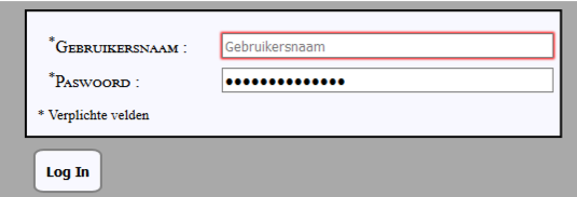
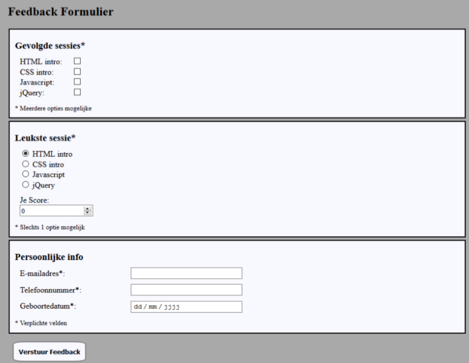

# Oefenreeks 03 Formulieren
## Oefening A
### OPGAVE/ STAPPEN
* Start met een lege folder als uitgangspunt voor je uitwerking

Voer volgende stappen uit met een editor naar keuze.

* Maak een nieuwe webpagina en noem deze **index.html**
* Voeg een titel toe aan je webpagina: ***Formulieren***
* Koppel een stylesheet aan je pagina en zorg ervoor dat deze zich in een passende folder zit binnen je uitwerking.
* Maak gebruik van de iconen die je terugvindt in images folder om op een passende manier een icon toe te voegen aan het tabblad van je pagina.
* Voeg een **h1** element toe op je pagina waar je de tekst ***“Oefeningen op formulieren”*** in plaatst.

Laat elke nieuwe uitwerking van een formulier voorafgaan door een **h2** element, plaats de naam van het formulier steeds in deze hoofding. 

#### REGISTRATIE FORMULIER
* Voeg een nieuw formulier toe 
  * Het formulier heeft een passende method en action
  * Bij verzenden wordt de data naar http://jkorpela.fi/cgi-bin/echo.cgi verzonden.
* Het formulier bevat een label genaamd: ***Gebruikersnaam*** 
* Dit label is op een passende manier verbonden aan het input element hiervoor.
  * Het input element heeft een passend type
  * Het input element is verplicht in te vullen
  * Een passende tekst binnenin het input element.
* Het formulier bevat een label genaamd: ***Paswoord***
* Dit label is op een passende manier verbonden aan het input element hiervoor.
  * Het input element heeft een passend type
  * Het input element is verplicht in te vullen 
  * Een passende tekst binnenin het input element.
* Het formulier bevat een input type die ons zal toelaten de data op het formulier te verzenden.
* Experimenteer via CSS om je uitwerking zo goed mogelijk te laten aansluiten bij het gegeven voorbeeld.
 
Onderstaand kan je een paar voorbeelden vinden van een mogelijk eindresultaat. 
 
##### VOORBEELD UITWERKING 

**INGEVULD**

 
**VERPLICHT VELD NIET INGEVULD**

#### FEEDBACK FORMULIER
* Voeg een nieuw formulier toe
  * Het formulier heeft een passende method en action
  * Bij verzenden wordt de data naar http://jkorpela.fi/cgi-bin/echo.cgi verzonden.
* Het formulier bevat een sectie ***‘Gevolgde sessies’*** 
  * Deze sectie bevat vier keuzes.
  * De gebruiker kan een of meer keuzes maken.
* Het formulier bevat een sectie ***‘Leukste sessie’*** 
  * Deze sectie bevat vier keuzes.
  * De gebruiker kan exact een keuze maken.
  * De gebruiker kan een score ingeven van 1 tot 10 (enkel gehele getallen)
* Het formulier bevat een sectie ***‘Persoonlijke info’***
  * Deze sectie bevat passende label – input combinaties voor onderstaande:
    * E-mailadres
    * Telefoonnummer
    * Geboortedatum
* Het formulier bevat een input type die ons zal toelaten de data op het formulier te verzenden.
* Experimenteer via CSS om je uitwerking zo goed mogelijk te laten aansluiten bij het gegeven voorbeeld. 

Onderstaand kan je een voorbeeld vinden van een mogelijk eindresultaat. 
 
##### VOORBEELD UITWERKING 

